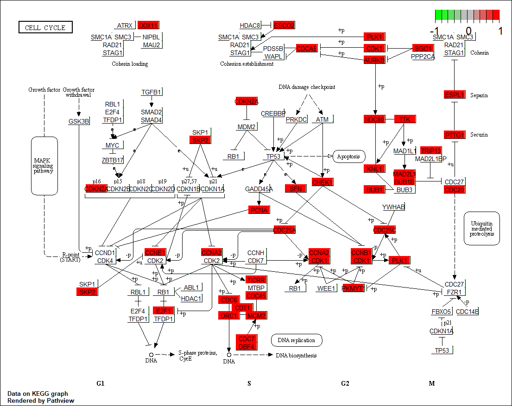
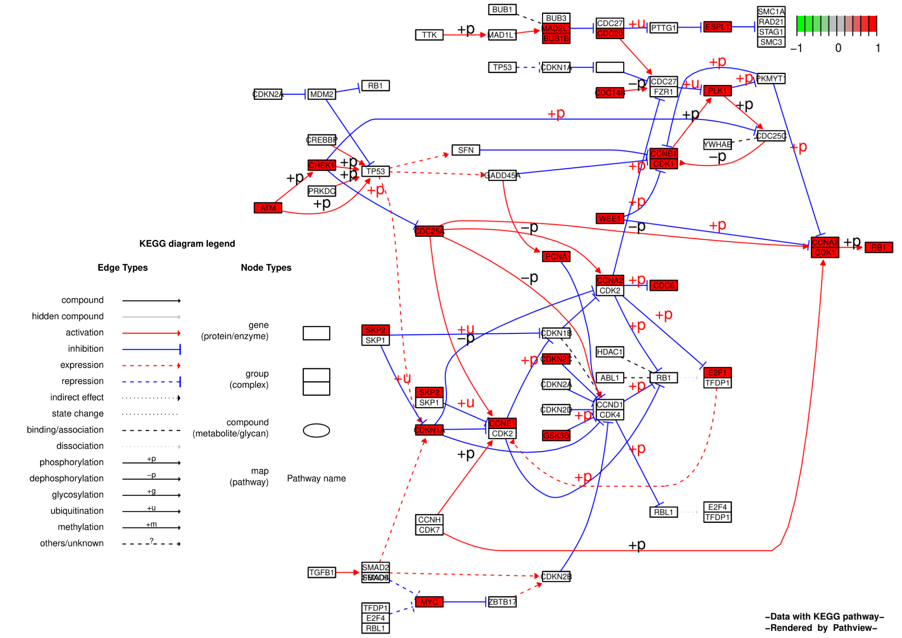
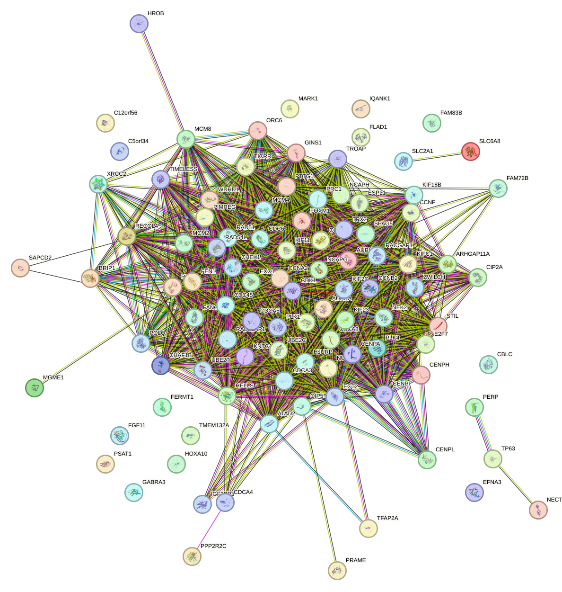
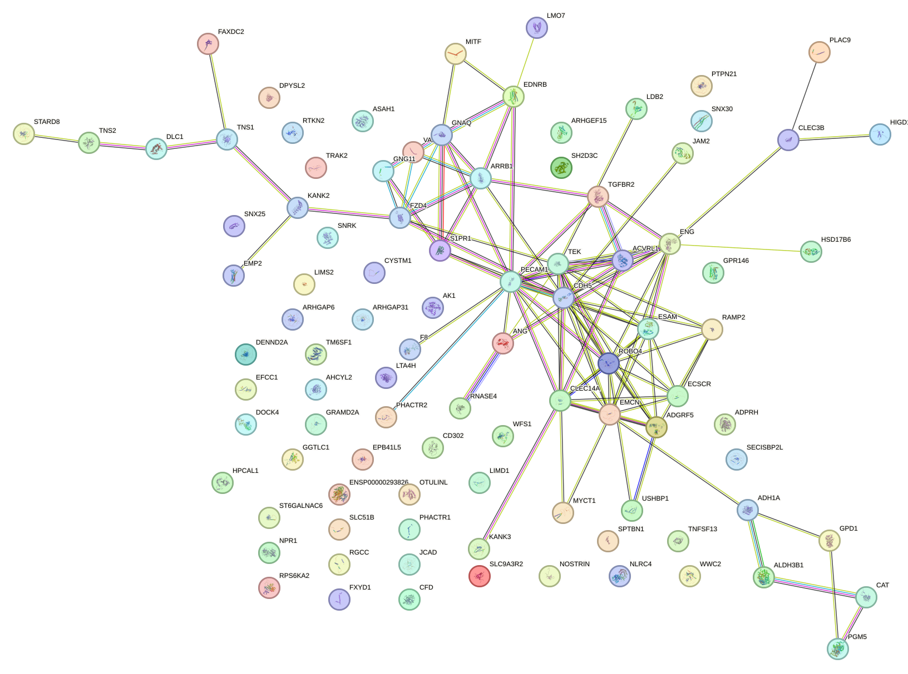
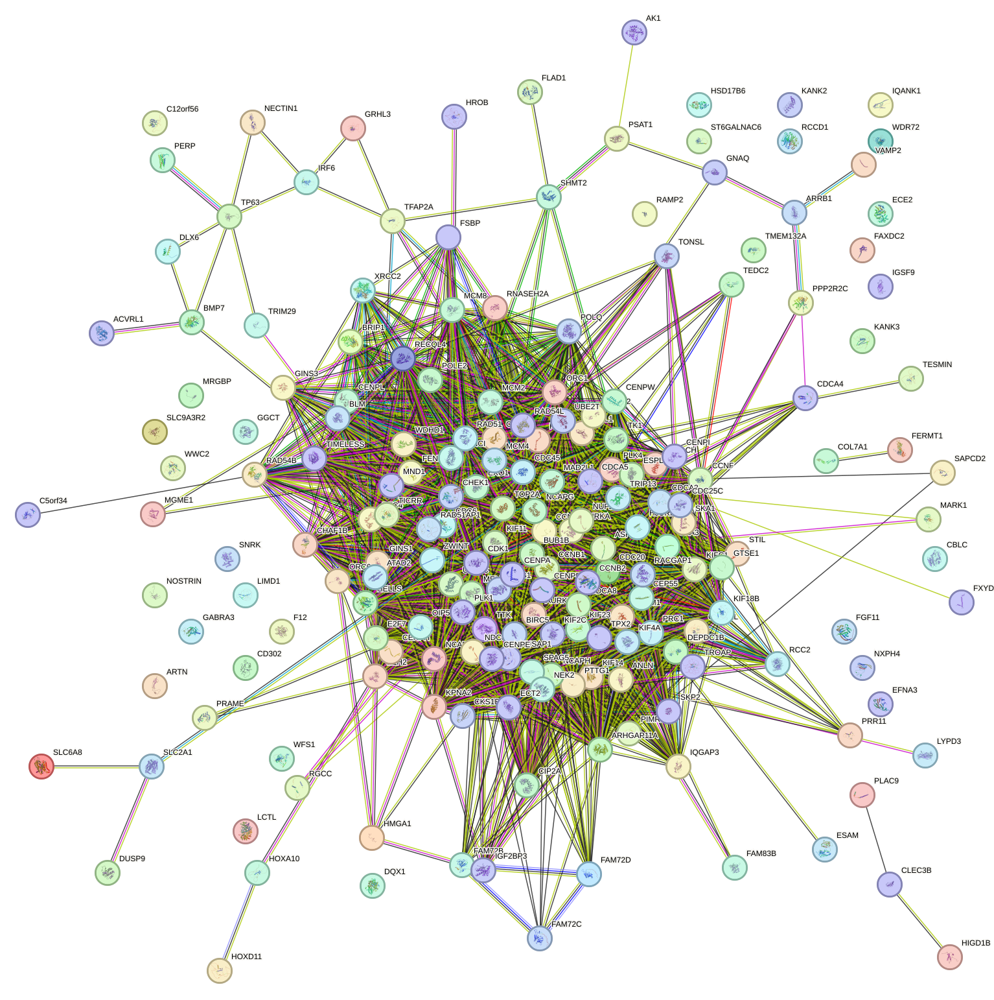

```{r setup, include=TRUE}
knitr::opts_chunk$set(echo = TRUE)
library("ggplot2")
library("biomaRt")
library("edgeR")
library("tidyverse")
library("GenomicFeatures")
library("clusterProfiler")
library("org.Hs.eg.db")
library("enrichplot")
library("DOSE")
library("pathview")
library("ggnewscale")
library("fgsea")
library("PWMEnrich")
library("PWMEnrich.Hsapiens.background")
library("MotifDb")
library("igraph")
library("statmod")
library("devtools")
library("rbioapi")
```

We have chosen the RNA-seq count data extracted from the lung squamous cell carcinoma dataset, knowing that from the original TCGA data 50 cases (tumor samples) and 50 controls (normal samples) were randomly selected.

**1. Load the RData file.**

```{r, include=TRUE}
path <- getwd() 
load(paste(path, "/Lung_squamous_cell_carcinoma.RData", sep=""))
```

We can see that three different data-frames have been uploaded. Let us inspect them separately.

```{r, include=TRUE}
head(raw_counts_df, 3)
cat("\nDimension: ", dim(raw_counts_df))
```

The data-frame *raw_counts_df* represents the raw RNA-seq counts (sequence reads per gene/how many reads have mapped to each gene): the rows correspond to the Ensembl Gene IDs (ex: ENSG00000278704) and the columns to the tumor and normal samples from which the reads were counted for each gene (ex: TCGA-22-4609-01A). 62940 genes are included in the data-frame and 100 samples are taken into account, 50 cases and 50 controls, respectively.

```{r, include=TRUE}
head(c_anno_df,10)
cat("\nDimension: ", dim(c_anno_df))
```

The data-frame *c_anno_df* specifies the condition (*condition* column) corresponding to each sample name (*sample* column), either "case" or "control". The number of rows (samples) is 100, properly matching the number of columns (samples) of *raw_counts_df*.

```{r, include=TRUE}
head(r_anno_df,10)
cat("\nDimension: ", dim(r_anno_df))
```

The data-frame *r_anno_df* maps each *Ensembl gene ID* from *raw_counts_df* to its *external gene name*, or gene symbol, and *length* (the number of bases in the primary transcript prior to splicing). So the number of rows is 62940.

**2. Extract protein-coding genes**

Since we want to perform differential gene expression analysis, we are interested only in protein coding genes, so we need to filter *raw_counts_df* according to this experimental choice. The R package **biomaRt** allows us to connect to a specific biomaRt database, in this case the ENSEMBL database, and to select the Human genes dataset.

```{r, include=TRUE}
ensembl<- useEnsembl(biomart = "ensembl", dataset = "hsapiens_gene_ensembl")
```

The *getBM()* function is the main query function in biomaRt and it has four main arguments: *attributes*, *filters*, *values* and *mart*. We have already set the latter and assigned it to the variable *ensembl*. The coding/non-coding information is included in the attribute *gene_biotype*. We have chosen to filter the Human genes dataset according to the *ensembl_gene_id* attribute, which we have at disposal to identify the genes belonging to our starting dataset related to lung squamous cell carcinoma.

```{r, include=TRUE}
anno_query<- getBM(attributes = c("ensembl_gene_id", "gene_biotype"), 
                   filters = ("ensembl_gene_id"), 
                   values = r_anno_df$ensembl_gene_id, 
                   mart = ensembl)
head(anno_query)
cat("\nDimension: ", dim(anno_query))
```

All the genes that were recognized by *Ensembl* are now matched to their type so we can subset the lung squamous cell carcinoma dataset to include only protein coding genes.

```{r, include=TRUE}
coding_query<-anno_query[which(anno_query$gene_biotype == "protein_coding"), ]
cat("\nDimension: ", dim(coding_query))
head(coding_query)
```

The number of genes has approximately become \~1/3 of the initial number of genes. After merging the *coding_query* result with the starting dataset, we have the updated version of the dataset, containing only protein coding genes (*clean_coding_raw*).

```{r, include=TRUE}
tmp<-raw_counts_df
coding_raw<- merge(coding_query,tmp, by.y = 'row.names', by.x = "ensembl_gene_id")
clean_coding_raw<- coding_raw[1:nrow(coding_raw),3:ncol(coding_raw)]
row.names(clean_coding_raw)= coding_raw$ensembl_gene_id
```

**3.Perform differential expression analysis**

The dataset contains standard counts, so the number of reads $X_i$ for each gene transcript $i$ in $N$ given samples/replicates. We need to obtain the counts per million (CPM, *read_millions*), so we can check the library size of each sample. We have generated a bar plot having the number of reads (per million) in the x-axis and the samples in the y-axis. In this way we can qualitatively asses a threshold for the necessary number of reads, valid for all samples, averaged across all gene transcripts (for each sample).

```{r, include=TRUE}
size_raw<-data.frame("sample"=colnames(clean_coding_raw),"read_millions"=colSums(clean_coding_raw/1000000))
ggplot(data=size_raw, aes(sample,read_millions))+
  geom_bar(stat="identity", fill="grey50",colour="grey50", width=0.7, alpha=0.7) + coord_flip() + theme_bw()
```

We are explicitly asked to filter raw counts data retaining only genes with a raw count \> 20 in at least 5 Cases or 5 Control samples. To do so, thanks to *apply()*, we use the *by()* function on each row (gene) of the clean dataset (with only protein-coding genes) to divide case samples from control samples and sum only the number of case samples and control samples (separately), that record (for each gene) a number of reads greater than the threshold. So, for each gene, we have two numbers, respectively for case and control.

```{r, include=TRUE}
threshold<-20
cat("\nType of condition: ", typeof(c_anno_df$condition))
# Convert condition in factor (now it is a character) to use by() function
c_anno_df$condition <- as.factor(c_anno_df$condition)
c_anno_df$condition <- factor(c_anno_df$condition, levels=c('control', 'case'))
cat("\nType of condition: ", typeof(c_anno_df$condition))
cat("\n Is condition a factor? ",is.factor(c_anno_df$condition))
filter_vec <- apply(clean_coding_raw,1,
    function(y) (by(y, c_anno_df$condition, function(x) sum(x > threshold))))
cat("\n")
print(filter_vec[,1250:1254])
table(filter_vec)
```

Since in the next step we need to pick at least 5 Cases or 5 Control samples, we now have to make an arbitrary choice between the two numbers: taking the maximum or minimum (for equal values the default choice is the first element, so control) will impact the downstream results, since we do not know which condition is chosen for each gene.

```{r, include=TRUE}
filter_vec_min <- apply(clean_coding_raw,1,
    function(y) min(by(y, c_anno_df$condition, function(x) sum(x > threshold))))
filter_vec_min[1250:1254]
```

```{r, include=TRUE}
filter_vec_max <- apply(clean_coding_raw,1,
    function(y) max(by(y, c_anno_df$condition, function(x) sum(x > threshold))))
filter_vec_max[1250:1254]
```

```{r, include=TRUE}
repl_thr<- 5

ct_min <-table(filter_vec_min)
ct_min
ct_min_df <- as.data.frame(ct_min)
cat("\nNumber of genes with 5 or more samples (case or control) with a number of reads > 20 (min): ", sum(ct_min_df[ct_min_df$filter_vec_min[repl_thr+1:51],2], na.rm = TRUE))
cat("\n")

ct_max <-table(filter_vec_max)
ct_max
ct_max_df <- as.data.frame(ct_max)
cat("\nNumber of genes with 5 or more samples (case or control) with a number of reads > 20 (max): ", sum(ct_max_df[ct_max_df$filter_vec_max[repl_thr+1:51],2],na.rm = TRUE))
cat("\n")
```

Looking at the contingency table, we have decided to go for *max()*, since the number of genes that meet the 5 replicates condition is greater (Also, see how many genes have respectively 0 and 50 samples that have a number of reads greater than 20). We proceed to remove genes with low signal, according to the 5 samples filtering.

```{r, include=TRUE}
filter_counts_df <- clean_coding_raw[filter_vec_max>=repl_thr,]
cat ("\nDimension: ", dim(filter_counts_df)) 
```

The dimension of the filtered dataset got even smaller, with 17511 genes as rows, so 4644 less. We have filtered the *r_anno_df* dataset as well to update the annotation corresponding to the filtered genes.

```{r}
filter_anno_df <- r_anno_df[rownames(filter_counts_df),]
dim(filter_anno_df)
```

In order to understand the distribution of the numbers of reads (each related to a gene ID) per sample, we have produced a box and whiskers plot, using the *geom_boxplot()* function, considering the numbers of reads as continuous variables, that we had to scale in log10 + 1 to avoid infinite values when the number of reads are zero for any gene ID of the considered replicate/sample.

```{r}
long_counts_df <- gather(filter_counts_df, key = "sample", value = "read_number")
ggplot(data=long_counts_df,aes(sample,read_number+1)) +
   geom_boxplot(colour="indianred",fill="indianred",alpha=0.7) +
   theme_bw() +
   scale_y_log10()

```

Under the assumption of independent and identically distributed variables, and being the number of variables (gene ID) large enough and the distribution not wild, we can assume that the central limit theorem holds and normalization of the number of reads per sample can take place. First we need to create a DGEList, *edge_c*, which stands for Digital Gene Expression List, having as parameters *counts*, *samples*, *gene* and *group*, all the necessary information to proceed with the number of reads per sample normalization.

```{r}
edge_c <- DGEList(counts=filter_counts_df,group=c_anno_df$condition,samples=c_anno_df,genes=filter_anno_df) 
head(edge_c)
```

We recall that TMM doesn't normalize the reads, but instead calculates normalization factors, since there can be composition biases, where certain genes have much higher read counts due to technical reasons, and we do not want to use them when calculating the library size. Instead of using the total library size (the sum of the reads for all genes), TMM trims off the most highly variable genes (Trimmed mean of M-values, where M-values are the log fold change between each sample and a reference) and then calculates a normalization factor that is used to adjust the library size when we compute logCPM values with the function *cpm()*. We have used the *geom_boxplot()* function again to visually check if the bar plots of the normalized distribution of the numbers of reads were more aligned, as expected.

```{r}
edge_n <- calcNormFactors(edge_c,method="TMM")
head(edge_n)

cpm_table <- as.data.frame(round(cpm(edge_n),2))
head(cpm_table)
long_cpm_df <- gather(cpm_table, key = "sample", value = "CPM") 

ggplot(data=long_cpm_df,aes(sample,CPM+1)) +
   geom_boxplot(colour="olivedrab",fill="olivedrab",alpha=0.7)+
   theme_bw()+
   scale_y_log10() 
```

```{r}
# Which values in cpm_table are greater than 0.25? 
# ( As a general rule, a good threshold can be chosen by identifying the CPM that corresponds to a count of 10)
thresh <- cpm_table > 0.25
# This produces a logical matrix with TRUEs and FALSEs
head(thresh)
# Summary of how many TRUEs there are in each row
# There are 13037 genes that have TRUEs in all 100 samples.
table(rowSums(thresh))
# we would like to keep genes that have at least 2 TRUES in each row of thresh
keep <- rowSums(thresh) >= 2
summary(keep)
# Let's have a look and see whether our threshold of 0.25 does indeed correspond to a count of about 10-15
# We will look at the first sample
plot(cpm_table[,1],filter_counts_df[,1])
# Let us limit the x and y-axis so we can actually look to see what is happening at the smaller counts
plot(cpm_table[,1],filter_counts_df[,1],ylim=c(0,50),xlim=c(0,3))
# Add a vertical line at 0.5 CPM
abline(v=0.25, col="blue")
abline(h=10, col="blue")
```

We have then applied unsupervised methods to gather preliminary information about the possibility of distinction between case and control samples, by applying hierarchical clustering with Ward's minimum variance criterion to the distance matrix, which results in the dendogram *hc*.

```{r}
clu_data <- t(scale(t(cpm_table)))
dd <- dist(t(clu_data), method = "euclidean") 
hc <- hclust(dd, method="ward.D")
plot(hc) 
```

We have also performed Principal Component Analysis.

```{r}
data.matrix <- cpm_table
color <- c(rep("red", ncol(cpm_table))) # case samples
color[grep('11A',colnames(data.matrix))]<-'blue' # control samples
data.PC <- prcomp(t(data.matrix),scale.=TRUE)
plot(data.PC$x[,1:2],xlim=c(-200,200),ylim=c(-200,200),col=color,pch=19)
text(data.PC$x[,1],data.PC$x[,2]+10,colnames(cpm_table),cex=0.7)

```

```{r}
library(ggfortify)
pca_res <- prcomp(t(data.matrix), scale. = TRUE)
autoplot(pca_res, colour=color) #label=TRUE, label.size=3
```

We can clearly see that the two clusters have been identified and separated (with a slight overlap at their central border, then canceled by a zoomed in visualization).

Linear modeling and differential expression analysis in edgeR requires a design matrix to be specified. The design matrix records which treatment conditions were applied to each sample, and it also defines how the experimental effects are parametrized in the linear models. This design matrix simply links each group to the samples that belong to it. Each row of the design matrix corresponds to a sample whereas each column represents a coefficient corresponding to one of the 2 groups.

```{r}
design <- model.matrix(~0+group, data=edge_n$samples)
colnames(design) <- levels(edge_n$samples$group)
rownames(design) <- edge_n$samples$sample
head(design)
```

As explained by Chen et al. (2016, doi: 10.12688/f1000research.8987.2):

> edgeR uses the negative binomial (NB) distribution to model the read counts for each gene in each sample. The dispersion parameter of the NB distribution accounts for variability between biological replicates. The NB model can be extended with quasi-likelihood (QL) methods to account for gene-specific variability from both biological and technical sources.

> Under the QL framework, the NB dispersion trend is used to describe the overall biological variability across all genes, and gene-specific variability above and below the overall level is picked up by the QL dispersion.

The estimation of QL dispersion is performed using the *glmQLFit()* function.

```{r}
# calculate dispersion and fit with edgeR (necessary for differential expression analysis)
edge_d <- estimateDisp(edge_n,design)

# the vertical axis of the plot shows square-root dispersion (or BCV)
plotBCV(edge_d)
```

The NB dispersions tend to be higher for genes with very low counts. The dispersion trend (blue curve) tends to decrease smoothly with abundance and to asymptotic to a constant value (red line) for genes with larger counts. The asymptotic value for the BCV seems to be greater than 0.5, which is acceptable for human subjects.

```{r}
edge_f <- glmQLFit(edge_d,design) #robust=TRUE
head(edge_f$coefficients)
summary(edge_f$df.prior)
#visualization of QL dispersion
plotQLDisp(edge_f)

```

The plot of the quarter-root QL dispersion against the average abundance of each gene shows that there is not a difference between the raw (before EB moderation) and squeezed (after EB moderation) dispersions' estimates.The summary statistics indicate small prior df estimates (the true unknown dispersions are highly variable), so weaker moderation towards the trend is appropriate.

The next step is to test for differential expression between the experimental groups. The contrast corresponding to case and control samples are constructed using the *makeContrasts()* function:

```{r}
contro <- makeContrasts("case-control", levels=design) 
```

For example, a positive log2-fold-change (logFC) will indicate an up-regulated gene in case samples with respect to control ones, whereas a negative logFC will indicate a less expressed gene in carcinoma than normal cells. We will use QL F-tests as they give stricter error rate control by accounting for the uncertainty in dispersion estimation. The top DE genes can be viewed with *topTags()*. We have set a p-value cutoff of 0.01, a log fold change ratio \> 1.5 for up-regulated genes and \< -1.5 for down-regulated genes and a logCPM \>1.

```{r}
# fit the model with generalized linear models
edge_t <- glmQLFTest(edge_f,contrast=contro)
# ordered by p-value
topTags(edge_t)
is.de <- decideTestsDGE(edge_t)
summary(is.de)
```

The top DE gene SLC2A1 has a large positive logFC, showing that it is far more highly expressed in the lung squamous carcinoma cells than normal. This gene is indeed known to be involved in a variety of cell death modalities and has been found to be associated with the prognosis and immune microenvironment of a variety of tumors. In particular, it is found to be highly expressed in LUSC (Wang et al., 2022, doi: 10.3389/fgene.2022.1068462).

```{r}
degs_example <- as.data.frame(topTags(edge_t,n=20, p.value = 0.01,sort.by = "logFC"))
degs_example
```

If we look at the results, sorting by logFC, the top DE gene is MAGEA9B, which is know to be expressed in many tumors of several types, including melanoma, head and neck squamous cell carcinoma, lung carcinoma and breast carcinoma,but not in normal tissues (genecards.org).

```{r}
plotMD(edge_t, status=is.de, values=c(1,-1), col=c("red","blue"),legend="topright")
```

The MD plot shows the log-fold change and average abundance of each gene. Significantly up and down DE genes are highlighted in red and blue, respectively.

Let's know apply the proposed filtering on logCPM, logFC and FDR.

```{r}
# keep all the DE genes with a pvalue lower than 0.01
DEGs <- as.data.frame(topTags(edge_t, n=nrow(edge_t), p.value=0.01)) # 12832 obs of 8 variables
DEGs$class <- "=" # 9 variables
DEGs$class[which(DEGs$logCPM>1&DEGs$logFC>(1.5)&DEGs$FDR<0.01)] <- "+"
DEGs$class[which(DEGs$logCPM>1&DEGs$logFC<(-1.5)&DEGs$FDR<0.01)] <-  "-"
DEGs <- DEGs[order(DEGs$logFC,decreasing = T),]
head(DEGs)
table(DEGs$class)
```

We have decided not to relax the threshold since the number of up-regulated and down-regulated is enough to proceed with the analysis. We have decided to display both the volcano plot and the MA plot, since they can be compared on the basis of the shared log FC values, respectively on the y-axis and on the x-axis. The MA plot does not provide information about the magnitude of the pvalue, while the volcano plot does not include the information about average expression.

```{r}
# display MA plot
input_df_MA <- DEGs
xlabel <- "log2 avg CPM (A)"
ylabel <- "log2 FC case vs control (M)"
par(fig=c(0,1,0,1), mar=c(4,4,1,2), mgp=c(2, 0.75, 0))	
plot(input_df_MA$logCPM, input_df_MA$logFC, xlab=xlabel, ylab=ylabel, 
     col=ifelse(input_df_MA$class=="=","grey70","olivedrab4"), pch=20, frame.plot=TRUE, cex=0.8, main="MA plot")
abline(h=0,lty=2,col="grey20")

```

```{r}
# Display volcano plot
input_df_VO <- DEGs
xlabel <- "log2 FC case vs control"
ylabel <- "-log10 p-value"
par(fig=c(0,1,0,1), mar=c(4,4,1,2), mgp=c(2, 0.75, 0))	
plot(input_df_VO$logFC, -log10(input_df_VO$PValue),xlab=xlabel, ylab=ylabel, 
     col=ifelse(input_df_VO$class =="=","grey70","olivedrab4"), pch=20, frame.plot=TRUE, cex=0.8, main="Volcano plot")
abline(v=0,lty=2,col="grey20")
```

The MA and Volcano plots can be improved by filtering out the DE genes that are not significant for our experiment. For example DE genes that have a log CPM \< 1 should not be included as grey dots in any plot. Also the colouring can be made consistent across plots by indicating up-regulated genes as red dots, down-regulated genes as blue dots, and not significant genes as black dots.

```{r}
# keep all the DE genes with a pvalue lower than 0.01
DEGs_clean <- as.data.frame(topTags(edge_t, n=nrow(edge_t), p.value=0.01))
DEGs_clean <- DEGs_clean[DEGs_clean$logCPM > 1, ] # 10940 obs. of 8 variables

DEGs_clean$class <- "="
DEGs_clean$class[which(DEGs_clean$logCPM>1&DEGs_clean$logFC>(1.5)&DEGs_clean$FDR<0.01)] <- "+"
DEGs_clean$class[which(DEGs_clean$logCPM>1&DEGs_clean$logFC<(-1.5)&DEGs_clean$FDR<0.01)] <-  "-"
DEGs_clean <- DEGs_clean[order(DEGs_clean$logFC,decreasing = T),]
head(DEGs_clean)
table(DEGs_clean$class)
```

Let's now reproduce the corresponding MA and Volcano plots.

```{r}
# display MA plot
input_df_MA <- DEGs_clean
xlabel <- "log2 avg CPM (A)"
ylabel <- "log2 FC case vs control (M)"
par(fig=c(0,1,0,1), mar=c(4,4,1,2), mgp=c(2, 0.75, 0))	
plot(input_df_MA$logCPM, input_df_MA$logFC, xlab=xlabel, ylab=ylabel, 
     col=ifelse(input_df_MA$class=="=","grey70","olivedrab4"), pch=20, frame.plot=TRUE, cex=0.8, main="MA plot")
abline(h=0,lty=2,col="grey20")

```

```{r}
# Display volcano plot
input_df_VO <- DEGs_clean
xlabel <- "log2 FC case vs control"
ylabel <- "-log10 p-value"
par(fig=c(0,1,0,1), mar=c(4,4,1,2), mgp=c(2, 0.75, 0))	
plot(input_df_VO$logFC, -log10(input_df_VO$PValue),xlab=xlabel, ylab=ylabel, 
     col=ifelse(input_df_VO$class =="=","grey70","olivedrab4"), pch=20, frame.plot=TRUE, cex=0.8, main="Volcano plot")
abline(v=0,lty=2,col="grey20")
```

```{r}
# display MA plot
input_df_MA <- DEGs_clean
xlabel <- "log2 avg CPM (A)"
ylabel <- "log2 FC case vs control (M)"

palette(c("blue", "red", "black"))
par(fig=c(0,1,0,1), mar=c(4,4,1,2), mgp=c(2, 0.75, 0))	
plot(input_df_MA$logCPM, input_df_MA$logFC, xlab=xlabel, ylab=ylabel, 
     col= factor(input_df_MA$class), frame.plot=TRUE, cex=0.8, pch=16, main="MA plot (2)", )
abline(h=0,lty=2,col="grey20")
legend(13, 10, legend=c("-", "+", "="),
       col=c("blue", "red", "black"), cex=0.8, title="class", pch=c(19,19,19))
```

```{r}
# Display volcano plot 
pVO <- ggplot(data = input_df_MA, aes(x = logFC, y = -log10(PValue), col=class, label="")) +
  ggtitle("Volcano plot (2)") +
  geom_point() +
  theme_minimal() +
  scale_color_manual(values = c("blue", "red", "black")) +
  geom_vline(xintercept = c(-1.5, 1.5), col = "gray", linetype = 'dashed') +
  geom_hline(yintercept = -log10(0.01), col = "gray", linetype = 'dashed') + geom_point(size = 1) 
pVO + theme(plot.title = element_text(color="black", size=14, face="bold",hjust = 0.5))

```

Then, we have created an annotated heatmap, focusing only on up and down-regulated genes.

```{r}

cols <- c(rep("chartreuse4",100))
cols[grep('11A',colnames(cpm_table))]<-'pink' # case - control
pal <- c("black", "grey", "white")
pal <- colorRampPalette(pal)(100)

# Heatmap representing all DE genes

# Saving the heatmap
# pdf(file="heatmap_all_DE_genes.pdf")
heatmap(as.matrix(cpm_table[which(rownames(cpm_table)%in%DEGs_clean$ensembl_gene_id[which(DEGs_clean$class!="=")]),]), ColSideColors = cols,cexCol = 0.5,margins = c(4,4),col=pal,cexRow = 0.2, Rowv = TRUE) #xlab="Samples", ylab = "Genes", Colv = NA
legend("topright", legend=c("lowest", "middle", "highest"), fill = c("black", "grey", "white"), cex = 0.8, title="DE genes \n (scaled \n CPM counts)")
legend("bottomright", legend=c("case", "control"), fill = c("chartreuse4", "pink"), cex = 0.8, title="Samples")
#dev.off

```

We note that the *Colv* parameter has its default value, so the column dendogram is reordered and a control sample gets included in a cluster belonging to the case side. Moreover, we cannot actually verify that the heatmap is properly constructed, due to the high number of genes. So, we have decided to make a reduced version of this heatmap, focusing only on the top 20 differentially expressed genes, 10 from the up-regulated subset and 10 from the down-regualted subset, respectively. First, we subset the DEGs dataset into two different ones (*upreg_df* and *downreg_df*), respectively for up and down-regulated genes. Then we order them according to logFC (from maximum positive to minimum positive value for up-regulated genes, from minimum negative to maximum negative for down-regulated genes). Second, we have to order the samples of *c_anno_df* to split case and control as two subgroups. Then, we have selected the top 10 DE genes (by *ensembl_gene_id*) from *upreg_df* and *downreg_df*, respectively. In order to properly configure the heatmap matrix, we had to sort the *cpm_table* columns (samples), matching the two subgroups (case-control) of *ordered_c_anno_df*. Finally, we have displayed the reduced version of the heatmap, replacing ensemble gene IDs with gene names.

```{r}

upreg_df <- DEGs_clean[DEGs_clean$class=="+",]
downreg_df <- DEGs_clean[DEGs_clean$class=="-",]

# Ordering up and down regulated genes by log fold change
upreg_df <- upreg_df[order(-upreg_df$logFC),]
downreg_df <- downreg_df[order(downreg_df$logFC),]
 
# Ordering samples in case-control for the heatmap
ordered_c_anno_df <- c_anno_df
ordered_c_anno_df$condition <- as.character(ordered_c_anno_df$condition)
ordered_c_anno_df <- ordered_c_anno_df[with(ordered_c_anno_df, order(condition)), ] 

# Heatmap representing the top 20 differentially expressed genes 10 from the up-regulated subset and 10 from the down-regulated sub-set

heatmap_sub_matrix <- as.matrix(cpm_table[rbind(head(upreg_df, 10), head(downreg_df, 10))$ensembl_gene_id,])[, ordered_c_anno_df$sample]
heatmap_sub_matrix <- as.data.frame(heatmap_sub_matrix)
# Substitute ensembl_gene_id with external_gene_name
genename_sub_heatmap <- merge(DEGs_clean, heatmap_sub_matrix, by="row.names")
genename_sub_heatmap <- subset(genename_sub_heatmap, select = -c(length, logFC, logCPM, F, PValue, FDR, class, ensembl_gene_id, Row.names))
row.names(genename_sub_heatmap) <-genename_sub_heatmap$external_gene_name
genename_sub_heatmap <- subset(genename_sub_heatmap, select = -c(external_gene_name))

cols <- c(rep("chartreuse4",50),rep('pink',50))
# Saving the heatmap
# pdf(file="heatmap_top20_DE_genes.pdf")
heatmap(as.matrix(genename_sub_heatmap), ColSideColors = cols, cexCol = 2,margins = c(2,13),col = pal, cexRow = 1, Colv = NA, Rowv = TRUE, xlab = "Samples", labCol = FALSE)
legend("topright", legend=c("lowest", "middle", "highest"), fill = c("black", "grey", "white"), cex = 0.8, title="DE genes \n (scaled CPM counts)")
legend("bottomright", legend=c("case", "control"), fill = c("chartreuse4", "pink"), cex = 0.8, title="Samples")
#dev.off
```

By looking at this heatmap, we can clearly distinguish the up-regulated from the down-regulated genes. For example, SFTPC and AGER genes have higher CPM counts in the control samples, confirming their down-regulation from the DE analysis. Also, genes belonging to the 'MAGE' family, found to be up-regulated, have higher cpm counts in the case samples with respect to control ones. For the latter case, we have found biological validation from literature (Hoang & Landi, 2022, <https://doi.org/10.3390/cancers14040961>).

**Perform gene set enrichement analysis**

Let's start by performing GO (BP and MF) analysis, focusing on the top 10 enriched GO terms, respectively for the up and down regulated genes.

```{r}
## Perform Gene Ontology enrichment analysis (Biological Process) on up-regulated genes.
ego_BP_up <- enrichGO(gene = upreg_df$external_gene_name,
                   OrgDb = org.Hs.eg.db,
                   keyType = 'SYMBOL',
                   ont = "BP",
                   pAdjustMethod = "BH",
                   pvalueCutoff = 0.05,
                   qvalueCutoff = 0.05)
```

```{r}
## Visualize the top 10 enriched terms
barplot(ego_BP_up, showCategory = 10)
dotplot(ego_BP_up, showCategory = 10)
heatplot(ego_BP_up,showCategory =10)
```

By looking at the first view (barplot) of the GO enrichment analysis performed in the context of Biological Process, we have detected as high ranking terms (by adjusted p-value) epidermis and skin development, along with phenomema related to cellular duplication. Knowing that proliferation is an important part of cancer development and progression, we can unambigously state that over-expression of genes related to cell cycle is coherent with the provided data, which is about Lung Squamouos Cell Carcinoma (LUSC). Additionally, we have found publications that link lung cancer with skin metastasis of the back and hand (Khaja et al., 2019, doi: 10.1159/000501363) and fungating ulcerated skin lesion (Chisenga et al., 2022, <https://doi.org/10.1186/s13256-022-03352-4>).

In particular, from the second view (dotplot), we can see that the highest number of genes are involved in the process of organelle fission. From literature (Boulton & Caino, 2002, doi: 10.3389/fcell.2022.849962), we have discovered that altered mitochondrial fission and fusion change tumor cell growth, metabolism, motility, and invasion, validating our experiment.

To further analyse the BP enrichemnt results, we have calculated the pairwise similarities of the enriched term, using the *pairwise_termsim()* function on GO BP for up-regulated genes, which exploits the Jaccard's similarity index (JC).

```{r}
x_BP_up <- pairwise_termsim(ego_BP_up)
emapplot(x_BP_up,showCategory = 10)
```

As expected, there are two main connected components, the bigger one regarding cellular duplication and the smaller one (triangle) concerning skin and epidermis development.

```{r}
## Perform Gene Ontology enrichment analysis (Biological Process) on down-regulated genes
ego_BP_down <- enrichGO(gene = downreg_df$external_gene_name,
                   OrgDb = org.Hs.eg.db,
                   keyType = 'SYMBOL',
                   ont = "BP",
                   pAdjustMethod = "BH",
                   pvalueCutoff = 0.05,
                   qvalueCutoff = 0.05)
```

```{r}
## Visualize the top 10 enriched terms
barplot(ego_BP_down, showCategory = 10)
dotplot(ego_BP_down, showCategory=10)
heatplot(ego_BP_down,showCategory =10)
```

By looking at the first view (barplot) of the GO enrichment analysis performed in the context of Biological Process, we have detected as high ranking terms (by adjusted p-value) leukocyte mediated immunity and regulation of cell adhesion. Knowing that decreased adhesion strength corresponds to increased metastatic potential (Beri et al., 2020, doi: 10.1158/0008-5472.CAN-19-1794), and that immune response is functionally impacted by cancer proliferation, we can safely state that under-expression of genes related to these processes is consistent with our experimental data.

In particular, from the second view (dotplot), we note that a high number of genes is involved in the positive regulation of MAPK cascade. We know from literature that this pathway has a key role in cell differentiation and apoptosis (Plotnikov et al., 2011, <https://doi.org/10.1016/j.bbamcr.2010.12.012>) and its regulation is disrupted by several diseases, including lung cancer.

```{r}
x_BP_down<- pairwise_termsim(ego_BP_down)
emapplot(x_BP_down,showCategory = 10)
```

As expected, there is a main connected component, regarding immune response and cell adhesion. MAPK cascade regulation is instead isolated, as well as vascular process in circulatory system. Nevertheless, these two processes remain relevant in the cancer context, according to literature.

```{r}
## Perform Gene Ontology enrichment analysis (Molecular Function) for up-regulated genes
ego_MF_up <- enrichGO(gene = upreg_df$external_gene_name,
                   OrgDb = org.Hs.eg.db,
                   keyType = 'SYMBOL',
                   ont = "MF",
                   pAdjustMethod = "BH",
                   pvalueCutoff = 0.05,
                   qvalueCutoff = 0.05)
```

```{r}
## Visualize the top 10 enriched terms
barplot(ego_MF_up, showCategory = 10)
dotplot(ego_MF_up, showCategory = 10)
heatplot(ego_MF_up,showCategory =10)
```

By looking at the first view (barplot) of the GO enrichment analysis performed in the context of Molecular Function, we have detected as high ranking terms (by adjusted p-value) single-stranded DNA helicase activity and structural constituent of skin epidermis. In particular, from the second view (dotplot), we note that a high number of genes is involved in tubulin and microtubule binding. These functions are consistent with the above discovered biological processes.

```{r}
x_MF_up<- pairwise_termsim(ego_MF_up)
emapplot(x_MF_up,showCategory = 10)
```

Pairwise-similarity analysis shows three main connected components: microtubule-related, helicase-related terms and a triangle of specific binding, including retinoid and isoprenoid. In particular, the over-expression of retinoid receptors (Tripathi et al., 2019 doi: 10.1016/j.phrs.2019.104331) is contemplated in lung cancer.

```{r}
## Perform Gene Ontology enrichment analysis (Molecular Function) for down-regulated genes
ego_MF_down <- enrichGO(gene = downreg_df$external_gene_name,
                   OrgDb = org.Hs.eg.db,
                   keyType = 'SYMBOL',
                   ont = "MF",
                   pAdjustMethod = "BH",
                   pvalueCutoff = 0.05,
                   qvalueCutoff = 0.05)
```

```{r}
## Visualize the top 10 enriched terms
barplot(ego_MF_down, showCategory = 10)
dotplot(ego_MF_down, showCategory = 10)
heatplot(ego_MF_down,showCategory = 10)
```

By looking at the first view (barplot) of the GO enrichment analysis performed in the context of Molecular Function, we have detected as high ranking terms (by adjusted p-value) immune receptor activity and extracellular matrix structural constituent. In particular, from the second view (dotplot), we note that a high number of genes is involved in glycosaminoglycan binding. The latter protein is involved in cancer development and progression (Wei et al., 2020, doi: 10.3390/ijms21175983) and it is one of the main components of the extracellular matrix, influencing cell behavior, matrix properties and immune supervision. These functions are consistent with the above discovered biological processes (immune response and cell adhesion).

```{r}
x_MF_down<- pairwise_termsim(ego_MF_down)
emapplot(x_MF_down,showCategory = 10)
```

Pairwise-similarity detects a bigger connected component related to extracellular matrix and an edge between heparin and glycosaminoglycan binding. Integrin binding results in a isolated node. Both heparin and glycosaminoglycan are consistent with the above discovered biological processes. Additionally, over-expression of integrin, due to the under-expression of its receptors, may provide a broad advantage to cancer by protecting it from apoptosis. Indeed integrin up-regulation promotes proliferation and invasion (Janes and Watt, 2006, <https://doi.org/10.1038/nrc1817>).

In order to use up-regulated and down-regulated gene subsets for the construction of WP Pathways, we need to include the Entrez IDs to the above-produced *DEGs_clean* dataset.

```{r}

# Use biomaRt to map Gene symbols, Entrez IDs and Ensembl gene IDs from DGEList object (DEGs_clean) 
convert <- getBM(attributes=c("ensembl_gene_id","entrezgene_id","external_gene_name"),
                 filters=c("ensembl_gene_id"), 
                 values=DEGs_clean$ensembl_gene_id,
                 mart = ensembl)
DEGs_entrez <- merge(DEGs_clean,convert,by.x="ensembl_gene_id",by.y="ensembl_gene_id")
DEGs_entrez <- DEGs_entrez[1:nrow(DEGs_entrez),1:(ncol(DEGs_entrez)-1)]
colnames(DEGs_entrez)[2] <- "external_gene_name"
DEGs_entrez <- DEGs_entrez[which(!is.na(DEGs_entrez$entrezgene_id)),] 
DEGs_entrez <- DEGs_entrez[-which(duplicated(DEGs_entrez$entrezgene_id)),] 
```

```{r}
ranks <- DEGs_entrez[, c("logFC","class")]
# associated each Entrez ID to the corresponding logFC
row.names(ranks) <- DEGs_entrez$entrezgene_id
ranks <- ranks[order(-ranks$logFC),]
head(ranks)
class_cols <- c(rep("red", sum(ranks$class == "+")),rep("black", sum(ranks$class == "=")), rep("blue", sum(ranks$class == "-")))

barplot(height = ranks$logFC, names = rownames(ranks), col=class_cols, xlab = "Entrez gene IDS", ylab = "logFC", border=NA)
abline(h=min(ranks$logFC[ranks$class == "+"]),lty=2,col="grey20")
abline(h=max(ranks$logFC[ranks$class == "-"]),lty=2,col="grey20")
legend(10000, 10, legend=c("-", "+", "="),
       fill=c("blue", "red", "black"), cex=0.8, title="class")


```

Having the gene Entrez IDs, we have to update the up and down-regulated gene subsets.

```{r}
upreg_df_entrez <- DEGs_entrez[DEGs_entrez$class=="+",]
downreg_df_entrez <- DEGs_entrez[DEGs_entrez$class=="-",]
```

We can now perform WP (over-representation) analysis on up and down-regulated genes, reporting the top 10 enriched pathways.

```{r}
eWP_up = enrichWP(gene = upreg_df_entrez$entrezgene_id,
                  organism = "Homo sapiens",
                  pvalueCutoff = 0.05,
                  qvalueCutoff = 0.05)
head(eWP_up, n=10)
```

It is interesting to note that Cell cycle and DNA replication are the top2 and top3 WP pathways, in agreement with the GO enrichment analysis on the up-regulated genes. Even though many types of cancer-related pathways are detected, they are not directly linked to lung. However, taking into account the possibility of tumor progression and metastasis, the involvement of other tissues is not to be a-priori excluded.

```{r}
eWP_down = enrichWP(gene = downreg_df_entrez$entrezgene_id,
                  organism = "Homo sapiens",
                  pvalueCutoff = 0.05,
                  qvalueCutoff = 0.05)
head(eWP_down, n=10)
```

The WP Complement system (top1) is linked to immune system and, along with coagulation (top4), is also present in the GO enrichment analysis for down-regulated genes.

For the sake of curiosity, we have also performed enriched KEGG pathways resulting from both up- and down-regulated gene lists.

```{r}
upkegg <- enrichKEGG(gene = upreg_df_entrez$entrezgene_id,
                     organism = 'human',
                     keyType = "kegg",
                     pAdjustMethod = "BH",
                     minGSSize = 10,
                     maxGSSize = 500,
                     pvalueCutoff = 0.05,
                     qvalueCutoff = 0.05,
                     use_internal_data = FALSE)
head(upkegg, n=10)

downkegg <- enrichKEGG(gene = downreg_df_entrez$entrezgene_id,
                       organism = 'human',
                       keyType = "kegg",
                       pAdjustMethod = "BH",
                       minGSSize = 10,
                       maxGSSize = 500,
                       pvalueCutoff = 0.05,
                       qvalueCutoff = 0.05,
                       use_internal_data = FALSE)
head(downkegg, n=10)
```

KEGG enrichment looks more consistent for the up-regulated genes than for the down-regulated genes, given the presence of many heterogeneous diseases, not necessarily related to cancer.

**Visualize an enriched pathway from the up-regulated gene list**

In order to use the function *pathview()*, we have to create a vector, containing logFC values related to the corresponding Entrez gene IDs, belonging to the up-regulated gene subset. Since the function only accepts KEGG enrichment pathway results as input, we have chosen the top1 Cell cycle pathway (*ID: hsa04110*), which is also present in WP pathway results, ranking second.

```{r}
logFC <- upreg_df_entrez$logFC
names(logFC) <- upreg_df_entrez$entrezgene_id

pT <- pathview(gene.data = logFC,
         pathway.id = 'hsa04110',
         species = "human",
         kegg.native = T,
         same.layer = F)

head(pT$plot.data.gene)
str(pT)


```



```{r}
pF <- pathview(gene.data = logFC,
         pathway.id = 'hsa04110',
         species = "human",
         kegg.native = F,
         same.layer = F
)

head(pF$plot.data.gene)
str(pF)

```



Depending on the *kegg.native* parameter setting, *pathview()* outputs either two png images of the Cell cycle annotated pathway (corresponding to the *pathway.id* parameter provided by KEGG enrichment) or a pdf image exploiting the Grapviz view, which contains a detailed legend of edges and nodes. The latter visualization helps the reader (biologist) explore the pair-wise relationships between genes. In particular, the red nodes represent the overlapping between the Cell cycle pathway and our subset of up-regulated genes. Indeed, they have a positive score, based on the logFC we have provided.

**6. Identify Transcription Factors with enriched scores in the promoters of all up-regulated genes**

To proceed in the analysis, we have decided to keep the *upreg_df_entrez* subset, to have as much consistency as possibile beween gene identifications and for reusability purposes. Then, we have used the *getSequence()* function to extract the promoter sequences (flanking sequences) of all the included up-regulated genes (by emsembl IDs), with a window of 500 nucleotides upstream each gene.

Next, we are going to determine whether the regulatory sequences (e.g., promoters) of the set of up-regulated genes have significantly higher than expected affinity for a regulatory protein or microRNA for which the DNA-binding motif is known (through the PWM matrices provided by *PWMLogn.hg19.MotifDb.Hsap* for each candidate), using the *motifEnrichment()* function (the lognormal affinity background distribution is applied). Such a motif will be considered "enriched" in the set of sequences. The regulatory proteins whose motifs are most enriched in the set of regulatory sequences (of the up-regulated genes) are candidate transcriptional regulators for some or all of the genes and this result is calculated by the *groupReport()* function. In particular, by setting *by.top.motifs = T*, we ranks motifs by breadth of enrichment, which is calculated by comparing enrichment between motifs in individual sequences. We then select the first 5 (supposed) Transcription Factors corresponding to the top enriched motifs, trough the plot function, using a p-value of 0.05 as a threshold on the groupReport output (*report* variable).

```{r}
ensembl <-useMart(biomart = 'ensembl', dataset = 'hsapiens_gene_ensembl')
promoter_seq <- getSequence(id = upreg_df_entrez$ensembl_gene_id,
                            type = 'ensembl_gene_id',
                            seqType = 'gene_flank',
                            upstream = 500,
                            mart = ensembl
)

# Transform each gene flank into a DNA String object for efficient storage and manipulation of long DNA sequences
sequences <- lapply(promoter_seq$gene_flank, function(x) DNAString(x))

data("PWMLogn.hg19.MotifDb.Hsap")
enriched_TFs <- motifEnrichment(sequences, PWMLogn.hg19.MotifDb.Hsap, score = "affinity")

report <- groupReport(enriched_TFs, by.top.motifs = T)
report[report$p.value < 0.05]
plot(report[1:5], fontsize = 7, id.fontsize=5)

```

**7.Select one top enriched TF, compute the empirical distributions of scores for all the matching MOtifDB PWMs to find the 99.75% threshold cutoff.**

Now that we have identified which supposed TFs have the top enriched scores in the promoters of some (or all) up-regulated genes, we have selected the top2 enriched gene, JUND, which encodes for the transcription factor JunD, a member of the JUN family and a functional component of the AP1 transcription factor complex. It is known to be a proto-oncogene and has been proposed to protect cells from p53-dependent senescence and apoptosis. Additionally, JunD, in absence of c-Jun was found to be involved in Ras-induced lung cancer (Ruiz et al., 2021, 10.1172/jci.insight.124985).

We have ruled out PGAM2 (top1 enriched motif), since it encodes for a muscle-specific Phosphoglycerate Mutase, so it is a protein but not a TF (genecards.org & <https://www.ncbi.nlm.nih.gov>).

```{r}
# select JUND (TF)
TF <- report$target[2] 

# extract all PWMs in MotifDB that match the selected TF
TF_motifs <- subset(MotifDb, organism == 'Hsapiens' & geneSymbol == TF)
PWM = toPWM(as.list(TF_motifs))
names(PWM) = sapply(names(PWM),function(x) strsplit(x,"-")[[1]][3])
```

The function *motifEcdf()* computes the empirical cumulative distribution function of the scores (for each motif/PWM), that are obtained by *motifScores()* applied to the PWMs (18) against all the promoters of the human genome, that have different lengths, to find overall affinity.

```{r}

# calculate empirical score distributions for the JUND motifs (# compute the empirical distributions of scores for all the detected PWMs) against all genome promoters (of different lengths)
ecdf <- motifEcdf(PWM,organism = "hg19",quick=TRUE)

# calculate empirical score distribution for the JUND motifs against our set of promoters (background)
#  if raw.scores=TRUE, returns a list of raw score values (before cutoff)
scores <- motifScores(sequences, PWM, raw.scores = T, verbose=T)

# compute threshold cutoff on the empirical score distributions for all the PWS (against all genome promoters)
threshold <- lapply(ecdf, function(x) quantile(x, 0.9975))

```

**8. Identify which up-regulated genes have a region in their promoter with binding scores for JUND above the computed threshold**

```{r}
# calculate empirical score distribution for the JUND motifs against our set of promoters (background)
#  if raw.scores=FALSE and cutoff=threshold(0.9975), returns a list of score values after cutoff
scores = motifScores(sequences, PWM, raw.scores = FALSE, cutoff = unlist(threshold))
scores_sign <- which(apply(scores,1,sum) > 0)
# subset of up-regulated genes with score above threshold
enriched_jund <- upreg_df_entrez[scores_sign, 2]
length(enriched_jund)
```

Since the number of up-regulated genes with binding affinity for JUND is 1345 over 1492 (the total number of up-regulated genes), about the 90%. This result is not informative. Hence we have decided to raise the threshold to 99.9%.

```{r}
threshold_update <- lapply(ecdf, function(x) quantile(x, 0.999))
scores_update = motifScores(sequences, PWM, raw.scores = FALSE, cutoff = unlist(threshold_update))
scores_sign_update <- which(apply(scores_update,1,sum) > 0)
# subset of up-regulated genes with score above threshold
enriched_jund_update <- upreg_df_entrez[scores_sign_update, 2]
length(enriched_jund_update)
```

The number of up-regulated genes with binding affinity for JUND has now become 579 over 1492, about 39%, which seems more reasonable.

**9. Find PPI interactions among differentially expressed genes and export the network in TSV format**

```{r}
# Resume up and down-regulated gene subsets, ordering by p-value
upreg_STRING <- upreg_df[order(upreg_df$PValue),]
downreg_STRING <- downreg_df[order(downreg_df$PValue),]
# Merge up and down-regulated gene subsets to get a list of all the DE genes (ordered by p-value)
all_de_STRING <- rbind(upreg_STRING,downreg_STRING)
all_de_STRING <- all_de_STRING[order(all_de_STRING$PValue),]

# Export the above produced lists for STRING website (cutting the lists for readability purposes)
write(upreg_STRING$external_gene_name[1:100],"100_upreg_gene_names.txt")
write(downreg_STRING$external_gene_name[1:100], "100_downreg_gene_names.txt")
write(all_de_STRING$external_gene_name[1:200], "200_DE_gene_names.txt")
#STRING maximum input of genes
write(all_de_STRING$external_gene_name[1:2000], "2000_DE_gene_names.txt")
write(all_de_STRING$external_gene_name, "all_DE_gene_names.txt")
```

We are supposed to upload the generated txt files on the STRING web interface. Alternatively, we can connect to STRING APIs through the package *rbioapi*, avoiding the intermediate steps of txt files' production and use of the web interface.

First we get the PNG images of the PPI interactions' networks through the function *rba_string_network_image*, to have a qualitative assessment of the results.

```{r}
# PNG images of the PPI interactions output networks from STRING corresponding to up-regulated (first 100), down-regulated (first 100), all DE (first 200 and 2000) lists. We chose to cut the lists for readability purposes and STRINGdb constraints.

PPI_graph_up <- rba_string_network_image(ids=upreg_STRING$external_gene_name[1:100], image_format = "image", species = 9606, network_flavor = "evidence")
```



```{r}
PPI_graph_down <- rba_string_network_image(ids=downreg_STRING$external_gene_name[1:100], image_format = "image", species = 9606, network_flavor = "evidence")
```



```{r}
PPI_graph_DE_200 <- rba_string_network_image(ids=all_de_STRING$external_gene_name[1:200], image_format = "image", species = 9606, network_flavor = "evidence")
```



```{r}
PPI_graph_DE_2000 <- rba_string_network_image(ids=all_de_STRING$external_gene_name[1:2000], image_format = "image", species = 9606, network_flavor = "evidence")
```


**10. Import the network in R and use *igraph* to identify and plot the largest connected component**

If we used the web interface to get the PPI interactions' networks, we would have to export the corresponding TSV files and then reload them into RStudio. Instead, we have decided to employ the function *rba_string_interactions_network()* from *rbioapi* to get the PPI interactions network information as it is contained in the TSV files (exportable from the STRING web interface). We are going to use both methods for the reduced up-regulated genes' subset to verify that their results are consistent (the same). If so, we will perform the LCC (Largest Connected Component) identification only with the *rbioapi* package, since it is quicker.

```{r}
# Alternative to tsv file upload (rbioapi)
PPI_net_up <- rba_string_interactions_network(ids=upreg_STRING$external_gene_name[1:100], species=9606, required_score = 400)

# Deleting duplicate rows (for undirected edges)
PPI_net_up <- distinct(PPI_net_up)
# formatting output to match igraph constraints
PPI_net_up <- PPI_net_up[, -c(1,2)] 

# tsv file upload (for consistency)
PPI_tsv_up <-  read.delim("100_upreg_STRING_PPI_interactions.tsv")

```

We have designed the find_largest_component function that is able to generate a graph and identify it's largest connected component using genes interaction informations.

```{r}
find_largest_comp <- function(PPI_net){
  #isolate unique gene names belonging to our data structure (grapg nodes)
  gene_names <- unique(unlist(PPI_net[, c(1,2)]), use.names = FALSE)
  #draw the graph
  graph_from_PPI <- graph_from_data_frame(PPI_net,gene_names,directed=FALSE)
  #find all connected components 
  conn_comp <- components(graph_from_PPI, mode = "strong")
  # find largest component
  largest_comp <- which.max(conn_comp$csize)
  # print largest component size ## 1676
  print(conn_comp$csize[largest_comp])
  # isolate largest component
  lc <- induced_subgraph(graph_from_PPI,V(graph_from_PPI)[conn_comp$membership == largest_comp])
  plot(lc,
       # edge proportional to combined score
       edge.width= E(lc)$combined_score*3,
       vertex.color="red",
       vertex.size=10,
       vertex.frame.color="darkgray",
       vertex.label.color="black",
       vertex.label.cex=0.7,
       edge.curved=0.1)
}
```

We can now use the *find_largest_component()* function both on .tsv files and our *rbioapi* data

```{r}
find_largest_comp(PPI_tsv_up)
find_largest_comp(PPI_net_up)
```

The result is consisten so we can apply the find_largest_component() function just to all the other PPI interactions networks in order to find meaningfull results.

```{r}
#Identify the largest component in the down-regulated genes graph
PPI_net_down <- rba_string_interactions_network(ids=downreg_STRING$external_gene_name[1:100], species=9606, required_score = 400)
PPI_net_down <- distinct(PPI_net_down)
PPI_net_down <- PPI_net_down[, -c(1,2)]
find_largest_comp(PPI_net_down)

#Identify the largest component in the the top 200 genes graph
PPI_net_DE_200 <- rba_string_interactions_network(ids=all_de_STRING$external_gene_name[1:200], species=9606, required_score = 400)
PPI_net_DE_200 <- distinct(PPI_net_DE_200)
PPI_net_DE_200 <- PPI_net_DE_200[, -c(1,2)]
find_largest_comp(PPI_net_DE_200)

#Identify the largest component in the the top 200 genes graph
PPI_net_DE_2000 <- rba_string_interactions_network(ids=all_de_STRING$external_gene_name[1:2000], species=9606, required_score = 400)
PPI_net_DE_2000 <- distinct(PPI_net_DE_2000)
PPI_net_DE_2000 <- PPI_net_DE_2000[, -c(1,2)]
find_largest_comp(PPI_net_DE_2000)
```
